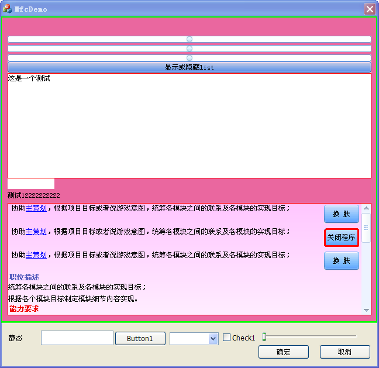

# Duilib 快速入门

## 1. 基本框架

一个简单的Duilib程序一般是下面这个样子的：

```cpp
// Duilib使用设置部分
#pragma once

#define WIN32_LEAN_AND_MEAN	
#define _CRT_SECURE_NO_DEPRECATE

#include <windows.h>编写界面xml
#include <objbase.h>

#include "..\DuiLib\UIlib.h"

using namespace DuiLib;

#ifdef _DEBUG
#   ifdef _UNICODE
#       pragma comment(lib, "..\\bin\\DuiLib_ud.lib")
#   else
#       pragma comment(lib, "..\\bin\\DuiLib_d.lib")
#   endif
#else
#   ifdef _UNICODE
#       pragma comment(lib, "..\\bin\\DuiLib_u.lib")
#   else
#       pragma comment(lib, "..\\bin\\DuiLib.lib")
#   endif
#endif

// 窗口实例及消息响应部分
class CFrameWindowWnd : public CWindowWnd, public INotifyUI
{
public:
    CFrameWindowWnd() { };
    LPCTSTR GetWindowClassName() const { return _T("UIMainFrame"); };
    UINT GetClassStyle() const { return UI_CLASSSTYLE_FRAME | CS_DBLCLKS; };
    void OnFinalMessage(HWND /*hWnd*/) { delete this; };

    void Notify(TNotifyUI& msg)
    {
        if( msg.sType == _T("click") ) {
            if( msg.pSender->GetName() == _T("closebtn") ) {
                Close();
            }
        }
    }

    LRESULT HandleMessage(UINT uMsg, WPARAM wParam, LPARAM lParam)
    {
        if( uMsg == WM_CREATE ) {
            m_pm.Init(m_hWnd);
            CControlUI *pButton = new CButtonUI;
            pButton->SetName(_T("closebtn"));
            pButton->SetBkColor(0xFFFF0000);
            m_pm.AttachDialog(pButton);
            m_pm.AddNotifier(this);
            return 0;
        }
        else if( uMsg == WM_DESTROY ) {
            ::PostQuitMessage(0);
        }
        LRESULT lRes = 0;
        if( m_pm.MessageHandler(uMsg, wParam, lParam, lRes) ) return lRes;
        return CWindowWnd::HandleMessage(uMsg, wParam, lParam);
    }

public:
    CPaintManagerUI m_pm;
};

// 程序入口及Duilib初始化部分
int APIENTRY WinMain(HINSTANCE hInstance, HINSTANCE /*hPrevInstance*/, LPSTR /*lpCmdLine*/, int nCmdShow)
{
    CPaintManagerUI::SetInstance(hInstance);
    CPaintManagerUI::SetResourcePath(CPaintManagerUI::GetInstancePath());

    CFrameWindowWnd* pFrame = new CFrameWindowWnd();
    if( pFrame == NULL ) return 0;
    pFrame->Create(NULL, _T("测试"), UI_WNDSTYLE_FRAME, WS_EX_WINDOWEDGE);
    pFrame->ShowWindow(true);
    CPaintManagerUI::MessageLoop();

    return 0;
}
```

可以看出，这个程序分三个部分：

- Duilib使用设置部分

这个部分都是一些使用Duilib所需要的头文件和自动链接到相应的Duilib库，一般来说基本上不用改动。

- 窗口实例及消息响应部分

基本的窗口实现类和简单的消息响应，需要重点关注的是void Notify(TNotifyUI& msg)中的事件处理，这是Duilib程序最重要的部分。

- 程序入口及Duilib初始化部分

Duilib初始化和窗口创建。

编译这个程序，出现如下效果：


点击红色区域的任意位置，窗口会立即关闭。这样我们就完成了最简单的一个Duilib程序编写，虽然这个例子还不能展现Duilib的强大，但也算是麻雀虽小，肝胆俱全了。

因为很多美观的界面都不使用系统的标题栏和边框这些非客户区绘制，我们也把这掉，修改
CFrameWindowWnd:: HandleMessage为:

```cpp
    LRESULT HandleMessage(UINT uMsg, WPARAM wParam, LPARAM lParam)
    {
        if( uMsg == WM_CREATE ) {
            m_pm.Init(m_hWnd);
            CControlUI *pButton = new CButtonUI;
            pButton->SetName(_T("closebtn"));
            pButton->SetBkColor(0xFFFF0000);
            m_pm.AttachDialog(pButton);
            m_pm.AddNotifier(this);
            return 0;
        }
        else if( uMsg == WM_DESTROY ) {
            ::PostQuitMessage(0);
        }
        else if( uMsg == WM_NCACTIVATE ) {
            if( !::IsIconic(m_hWnd) ) {
                return (wParam == 0) ? TRUE : FALSE;
            }
        }
        else if( uMsg == WM_NCCALCSIZE ) {
            return 0;
        }
        else if( uMsg == WM_NCPAINT ) {
            return 0;
        }
        LRESULT lRes = 0;
        if( m_pm.MessageHandler(uMsg, wParam, lParam, lRes) ) return lRes;
        return CWindowWnd::HandleMessage(uMsg, wParam, lParam);
}
```

编译运行，我们得到如下效果：


## 2. 编写界面xml

为了使用xml进行界面布局，需要把前面的Duilib程序框架中的HandleMessage稍微改动一下：

```cpp
    LRESULT HandleMessage(UINT uMsg, WPARAM wParam, LPARAM lParam)
    {
        if( uMsg == WM_CREATE ) {
            m_pm.Init(m_hWnd);
            CDialogBuilder builder;
            CControlUI* pRoot = builder.Create(_T("test1.xml"), (UINT)0, NULL, &m_pm);
            ASSERT(pRoot && "Failed to parse XML");
            m_pm.AttachDialog(pRoot);
            m_pm.AddNotifier(this);
            return 0;
        }
        else if( uMsg == WM_DESTROY ) {
            ::PostQuitMessage(0);
        }
        else if( uMsg == WM_NCACTIVATE ) {
            if( !::IsIconic(m_hWnd) ) {
                return (wParam == 0) ? TRUE : FALSE;
            }
        }
        else if( uMsg == WM_NCCALCSIZE ) {
            return 0;
        }
        else if( uMsg == WM_NCPAINT ) {
            return 0;
        }
        LRESULT lRes = 0;
        if( m_pm.MessageHandler(uMsg, wParam, lParam, lRes) ) return lRes;
        return CWindowWnd::HandleMessage(uMsg, wParam, lParam);
}
```

灰色部分表示改动的部分。然后我们来编写一个简单的xml：

```xml
<?xml version="1.0" encoding="UTF-8"?>
<Window mininfo="200,360" size=" 480,320 ">
		<Font name="幼圆" size="16" default="true" />
		<VerticalLayout bkcolor="#FFFF00FF">
			<Button name="changeskinbtn" height="20" text="测试按钮" maxwidth="120" />
			<RichEdit name="testrichedit" bordercolor="#FF0000" bordersize="0" borderround="18,18" inset="4,2,4,2" bkcolor="#A0F2F5FA" bkcolor2="#A0FF0000" bkcolor3="#A0F2F5FA" font="1" multiline="true" vscrollbar="true" autovscroll="true" enabled="true" rich="true" readonly="false" text="测试richedit">
			</RichEdit>
			<Edit name="testedit" text="测试编辑框" />
		</VerticalLayout>
</Window>
```

把以上xml保存为test1.xml，主要保存格式为utf-8（不要使用windows自带的记事本保存，可以使用ultraedit、editplus之类具备xml编辑能力的编辑器保存）。然后运行程序，可以看到如下效果：


好像还不是太难看，不过按钮好像看起来不大像按钮，那就给贴个图把，将一下这行加入到Window标签下：

```xml
	<Default name="Button" value="normalimage=&quot;file='button_nor.bmp' corner='4,2,4,2' fade='200' hsl='true'&quot; hotimage=&quot;file='button_over.bmp' corner='4,2,4,2' fade='200' hsl='true'&quot; pushedimage=&quot;file='button_down.bmp' corner='4,2,4,2' fade='200' hsl='true' &quot; " />

```
然后将button_nor.bmp、button_over.bmp、button_down.bmp（可在Duilib发行包中找到）放到exe目录下，运行程序，可以看到：


可以看到按钮的显示已经改变了，我们继续将Richedit换个背景，将Richedit的背景色改成bkcolor="#FFF2F5FA" bkcolor2="#FFA0A000" bkcolor3="#FFF2F5FA"，我们得到下面的结果：


继续修改这个xml，我们通过设置xml中控件的属性，可以很简单的实现自由调整界面。


## 3. 响应事件

Duilib中的事件响应有两种方式：

- 在事件处理类（一般使用窗口类）中实现INotifyUI接口，然后在Notify函数中处理事件

这种方式比较简单常用，示例如下：

```cpp
class CLoginFrameWnd : public CWindowWnd, public INotifyUI
{
public:
			// ……
    void Notify(TNotifyUI& msg)
    {
        if( msg.sType == _T("click") ) {
            if( msg.pSender->GetName() == _T("closebtn") ) { PostQuitMessage(0); return; }
            else if( msg.pSender->GetName() == _T("loginBtn") ) { Close(); return; }
        }
        else if( msg.sType == _T("itemselect") ) {
            if( msg.pSender->GetName() == _T("accountcombo") ) {
                CEditUI* pAccountEdit = static_cast<CEditUI*>(m_pm.FindControl(_T("accountedit")));
                if( pAccountEdit ) pAccountEdit->SetText(msg.pSender->GetText());
            }
        }
    }
}
```

- 使用代理机制处理事件

```cpp
class CLoginFrameWnd : public CWindowWnd, public INotifyUI
{
public:
    // ……
    bool OnAlphaChanged(void* param) 
    {
        TNotifyUI* pMsg = (TNotifyUI*)param;
        if( pMsg->sType == _T("valuechanged") ) {
            m_pm.SetTransparent((static_cast<CSliderUI*>(pMsg->pSender))->GetValue());
        }
        return true;
    }

    void OnPrepare() 
    {
        CSliderUI* pSilder = static_cast<CSliderUI*>(m_pm.FindControl(_T("alpha_controlor")));
        if( pSilder ) 
            pSilder->OnNotify += MakeDelegate(this, &CFrameWindowWnd::OnAlphaChanged);
    }
}
```

OnPrepare函数需要在控件创建完成之后调用。

# 4。 贴图描述

Duilib的表现力丰富很大程度上得益于贴图描述的简单强大。Duilib的贴图描述分为简单模式和复杂模式两种。
简单模式使用文件名做为贴图描述内容，在这种方式下，此图片将会以拉伸方式铺满控件。

复杂模式使用带属性的字符串表示贴图方式，既支持从文件中加载图片，也可以从资源中加载，具体如下：

- 如果是从文件加载，设置`file`属性，如`file='XXX.png'`，不要写`res`和`restype`属性
- 如果从资源加载，设置`res`和`restype`属性，不要设置`file`属性
- `dest`属性的作用是指定图片绘制在控件的一部分上面（绘制目标位置）
- `source`属性的作用是指定使用图片的一部分
- `corner`属性是指图片安装 scale9 方式绘制
- `mask`属性是给不支持alpha通道的图片格式（如bmp）指定透明色
- `fade`属性是设置图片绘制的透明度
- `hole`属性是指定scale9绘制时要不要绘制中间部分
- `xtiled`属性设置成true就是指定图片在x轴不要拉伸而是平铺，`ytiled`属性设置成`true`就是指定图片在 y 轴不要拉伸而是平铺：


## 5. 类html文本描述

Duilib使用一种经过简化的类html格式文本来描述复杂的图文格式。使用`<>`或`{}`符号来标识语法标签，支持标签嵌套，如`<l><b>text</b></l>`，但是应该避免交叉嵌套，如`<l><b>text</l></b>`。

- `<b>text</b>` 表示`text`的内容使用粗体
- `<c #xxxxxx>text</c>` 表示`text`内容使用`#xxxxxx`颜色，`#xxxxxx`表示16进制的RGB值
- `<f x>text</f>` 表示`text`内容使用x序号的字体
- `<i>text</i>` 表示`text`内容使用斜体
- `<i x y z>` 表示此次插入图片，`x`表示图片名称，`y`表示此图片包含几张字图片（可不填，默认值`1`），`z`表示当前使用的字图片`id`（可不填，默认值0）
- `<a x>text</a>` 表示`text`内容有链接功能，`x`表示链接地址（可不填），用法如app:notepad or http:www.xxx.com，此字符串需要在用户程序中解析处理。
- `<n>` 表示此次换行
- `<p x>text</p>` 表示`text`内容是一个段落（从这里开始换行），x表示此段落文字水平距离（可不填）
- `<r>text</r>` 表示text内容不使用语法标签功能
- `<s>text</s>` 表示text内容被选中（显示选中的背景颜色）
- `<u>text</u>` 表示text内容使用下划线
- `<x i>` 表示从此处向后面移动x个像素值
- `<y i>` 表示该行高度固定为y个像素值

使用标签功能需要把控件的`showhtml`属性设置为`true`。

## 6. 动态换肤

Duilib是一个以贴图为主要表现手段的界面库，实现换肤非常简单，可以通过给控件设置不同的图片来实现换肤，比如给需要换肤的控件调用CControlUI::SetBkImage。但是针对换肤功能，Duilib提供了更为简单的方法，即使用CPaintManagerUI::ReloadSkin。

假设我们给程序创建了两套皮肤，分别打包成skin1.zip和skin2.zip，在程序运行的时候，执行:

```cpp
CPaintManagerUI::SetResourceZip(_T("skin2.zip")); // 或者skin1.zip
CPaintManagerUI::ReloadSkin();
```

这样简单的两行代码，就实现了全部窗口从skin1皮肤到skin2皮肤的切换。你也可以随时再次调用上面两行代码，把皮肤切换回去。


## 7. Dll插件

Duilib支持使用外部dll来扩展控件：

- 在dll中，只需要实现一个接口CreateControl，如

```cpp
extern "C" __declspec(dllexport) CControlUI* CreateControl(LPCTSTR pstrType)
{
    if( _tcscmp(pstrType, _T("ButtonEx")) == 0 ) return new CButtonExUI;
    return NULL;
}
```

- 在使用程序中，需要在WinMain函数把插件dll使用CPaintManagerUI::LoadPlugin加载进来，然后就可以和内置控件一样使用了。

``cpp
int APIENTRY WinMain(HINSTANCE hInstance, HINSTANCE /*hPrevInstance*/, LPSTR /*lpCmdLine*/, int nCmdShow)
{
    CManager::SetInstance(hInstance);
    CManager::SetResourcePath(CManager::GetInstancePath());
CManager::LoadPlugin(PLUGINNAME);
// ……
}
```


## 8. 资源打包

Duilib使用资源打包功能非常简单，在程序开发完成后只需做两个步骤即可：

- 第一步，进入资源目录，然后使用具备zip压缩功能的软件（如winrar、winzip、7zip等）把布局xml和图片等资源压缩到一个zip文件包里。


- 第二步，在WinMain函数中CPaintManagerUI::SetInstance(hInstance)的后面加入

```cpp
CPaintManagerUI::SetResourceZip(_T("xxx.zip"))，如
int APIENTRY WinMain(HINSTANCE hInstance, HINSTANCE /*hPrevInstance*/, LPSTR /*lpCmdLine*/, int nCmdShow)
{
    CManager::SetInstance(hInstance);
    CManager::SetResourcePath(CManager::GetInstancePath());
    CPaintManagerUI::SetResourceZip(_T("xxx.zip"));
    // ……
}
```

这样就完成了资源打包功能，发布程序只需要把exe、dll和zip文件带上就行了。有时为了需要，也可以修改.zip为其他扩展名，比如.dat。


## 9. Duilib在MFC或WTL程序中的应用

MFC和WTL依托强大的Windows Common Controls实现和十多年的发展，在传统软件界面领域占了统治地位，很多的现有软件代码都是使用MFC（或WTL，下同，不再特别注明）写的。所以对于一个界面库来说，兼容MFC和WTL显的非常重要。

如果一个软件希望从MFC界面转换到Duilib，或者打算使用Duilib做界面，但是又希望使用MFC的其他功能，这时Duilib和MFC混合使用就派上用场了。

在MFC中使用Duilib，可以按以下步骤操作：

- 在BOOL CXXXApp::InitInstance()函数中，添加

```cpp
    DuiLib::CManager::SetInstance(CWinAppEx::m_hInstance);
    DuiLib::CManager::SetResourcePath(DuiLib::CManager::GetInstancePath());
```

注意需要添加在MFC窗口创建之前。


- 创建Duilib窗口类

```cpp
class CDuiWnd : public DuiLib::CWindowWnd, public DuiLib::INotifyUI
{
public:
    CDuiWnd();
    LPCTSTR GetWindowClassName() const;
    UINT GetClassStyle() const;
    void Notify(DuiLib::TNotifyUI& msg);
    LRESULT HandleMessage(UINT uMsg, WPARAM wParam, LPARAM lParam);

public:
    DuiLib::CPaintManager m_manager;
};

```

- 在MFC窗口类中创建Duilib窗口

```cpp
m_duiWnd.Create(*this, NULL, UI_WNDSTYLE_CHILD, 0, 0, 0, 642, 520);
m_duiWnd.Init();
```

m_duiWnd是MFC窗口类的成员变量。示例效果如下，绿色框内是Duilib窗口，外层是MFC对话框。



## 10. 更深入知识

### Duilib系统系统结构


### ActiveX控件结构图


### Duilib所有属性表汇总

[Duilib所有属性表汇总](attlist.xml)


### 更多Demo


